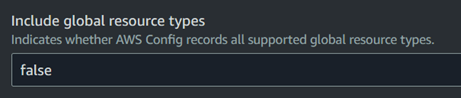
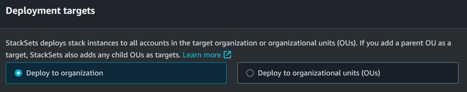
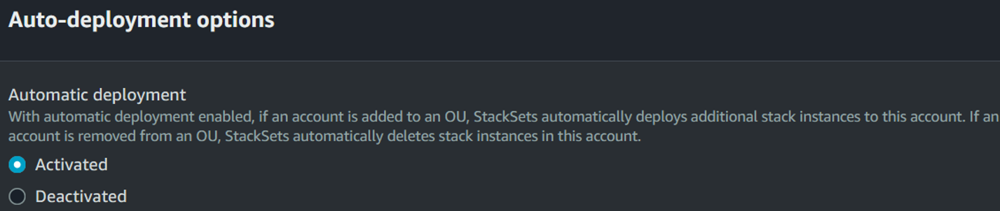

# Deploying CISv1.4.0 Security Benchmark recommended controls with Auto-remediation in an AWS Multi-account setup

This implementation uses AWS services like Security Hub, Lambda functions, and EventBridge rules, to perform near real-time "Automatic" remediation of NON-COMPLIANT resources in an AWS Organizations (multi-account) setup.

## Table of Contents
 - [Introduction](#1-introduction)
 - [Proposed Architecture](#2-proposed-architecture)
 - [Required AWS Services & Components](#3-required-aws-services--components)
 - [Environment Setup](#4-environment-setup)
 - [Remediation Actions](#5-remediation-actions)
    - [Unsupported CIS Controls](#5-1-unsupported-controls)
    - Supported CIS Controls(#update later)
        - IAM Controls(#update later)
        - Storage Controls(#update later)
        - Logging Controls(#update later)
        - Monitoring Controls(#update later)
        - Networking Controls(#update later)
 - [Test Results](#6-test-results)
 - #### ADD SOMETHING HERE

## 1. INTRODUCTION
### 1.1. Introduction
In the ever-evolving landscape of cloud computing, ensuring the security and compliance of cloud infrastructure has become paramount for organizations of all sizes. To address this critical need, the Center for Internet Security (CIS) has developed a set of comprehensive security benchmarks that provide organizations with a structured approach to securing their computer systems. 

By deploying the proposed automatic remediation solution for CIS security benchmarks in the AWS cloud, organizations can proactively fortify their infrastructure against potential threats and ensure adherence to industry-standard security configurations. This comprehensive approach will empower organizations to safeguard their sensitive data, maintain regulatory compliance, and foster a secure environment for their cloud operations.

### 1.2. What is CIS & CIS Benchmarks?

The Center for Internet Security (CIS) is a non-profit organization that develops and promotes best practices for securing IT systems and data, including cloud security. The CIS Benchmarks are a set of globally recognized and consensus-driven guidelines that help organizations protect against emerging cybersecurity risks. These benchmarks are developed with input from a global community of security experts and provide practical guidance for implementing and managing cybersecurity defenses.

### 1.3.	What are CIS AWS Foundations Benchmarks?

The CIS AWS Foundations Benchmark is a set of security best practices for Amazon Web Services (AWS) resources. It provides prescriptive instructions for configuring AWS services to ensure security and integrity. The most recent version is v1.4.0, released in 2021. Following this benchmark helps organizations reduce security risks and maintain compliance with industry regulations.

### 1.4.	Importance of CIS Benchmarks

The CIS Benchmarks are globally recognized and accepted best practice guides for securing IT infrastructure. The benchmarks are freely available for download and implementation, and provide up-to-date, step-by-step instructions for organizations to secure their infrastructure. 

The CIS Benchmarks align with major security and data privacy frameworks such as: 
* National Institute of Standards and Technology (**NIST**) Cybersecurity Framework
* Health Insurance Portability and Accountability Act (**HIPAA**)
* Payment Card Industry Data Security Standard (**PCI DSS**)

### 1.5.	CISv1.4.0 Recommended Controls

The CISv1.4.0 Control is composed of 4 sections with a total of 58 controls known as “recommendations.”
Below are the four sections:

- Identity and Access Management – 21 Controls
- Storage – 7 Controls
- Logging – 11 Controls
- Monitoring – 15 Controls
- Networking – 4 Controls

### 1.6.	Problem Statement

In an AWS Organization setup with hundreds of accounts, enforcing organization-level security regulations for each resource deployed in various regions is a tedious task. An organization's security team will need to put a lot of effort into taking necessary actions to increase the Compliancy score.

## 2. PROPOSED ARCHITECTURE

### 2.1. Security Hub setup in AWS Organizations


In an AWS Organizations setup, there will be a [Delegated Administrator Account](https://docs.aws.amazon.com/organizations/latest/userguide/orgs_delegate_policies.html) for Security Hub. This account will act as a Centralized Security Dashboard for the entire organization.

### 2.2. Remediation Action Flow based on a Security Hub Finding - Simplified


### 2.3. Remediation Action Flow based on a Security Hub Finding - Detailed


The above architecture will be explained in detail in the [Remediation Actions](#5-remediation-actions) section

## 3. REQUIRED AWS SERVICES & COMPONENTS

- [Config](https://docs.aws.amazon.com/config/latest/developerguide/WhatIsConfig.html) - the primary source that performs security configuration checks and sends them to AWS Security Hub.

- [Security Hub](https://docs.aws.amazon.com/securityhub/latest/userguide/what-is-securityhub.html) - provides a Centralized Security Dashboard that displays security finding status across all organization member accounts in a prioritized manner. Security Hub currently supports automated checks for standards like, 
    - AWS Foundational Security Best Practices (FSBP) v1.0.0
    - CIS Benchmarks v1.2.0
    - CIS Benchmarks v1.4.0
    - NIST 800-53 Revision 5
- [EventBridge](https://docs.aws.amazon.com/eventbridge/latest/userguide/eb-what-is.html) - helps in setting up rule-based triggers that will deliver events to selected targets.

- [Lambda](https://docs.aws.amazon.com/lambda/latest/dg/welcome.html) - event-driven serverless compute service that allows us to run our code in response to event triggers like EventBridge rules, without having to provision or manage servers.

- [IAM Roles](https://docs.aws.amazon.com/IAM/latest/UserGuide/id_roles.html) - it is an identity that has specific permissions. Unlike an IAM user, an IAM role does not have long-term credentials.  when you assume a role, it provides temporary security credentials for the role session. Some AWS Services will assume an IAM role to perform necessary actions.

- [Simple Notification Service](https://docs.aws.amazon.com/sns/latest/dg/welcome.html) - a fully managed distributed publish-subscribe system allowing mass delivery of emails, messages, and notifications.

- [CloudFormation StackSet](https://docs.aws.amazon.com/cloudformation/) - an Infrastructure-as-a-Code solution that helps in quick deployment of resources across multiple accounts and regions under a single operational management framework.

## 4. ENVIRONMENT SETUP

> Pre-requisite: An AWS Organization setup with multiple member accounts, and a management account. Also, Organization-level services like AWS Config, Security Hub, CloudFormation StackSet, CloudTrail, etc. must be enabled as per your requirement, and setup Delegated Administrator accounts for managing these services if needed.

### 4.1. Enable AWS Config

> To allow Security Hub to get its findings, we need to enable AWS Config in each region of all organization member accounts.

1. In the Organization’s CloudFormation StackSet Delegated Administrator, or the Management account, go to <code>CloudFormation > StackSets > Create StackSet</code> & upload the [Enable_AWS_Config.yml](./Cloud_Formation_Template/Enable_AWS_Config.yml) template file.
2. Choose the Parameters values as per your requirements. But let the <code>Include global resource types</code> as <code>FALSE</code>, because we don’t want AWS Config to perform redundant checks for Global resources like IAM in each region unnecessarily.

    
3. Set the <code>Deployment options</code> as per your requirement. But for our implementation, we need the deployment targets to be the entire organization.

    
4. Set the <code>Auto-deployment</code> options as <code>Activated</code>, so that when a new member is added, AWS Config is enabled as per our requirements.

   
5. Choose the deployment regions as per your requirement & Click Next > Submit to deploy.

Now, AWS Config will be enabled in all the organization member accounts in the regions you have specified.

### 4.2. Enable AWS Security Hub:

1. To enable AWS Security Hub in the organization member accounts, in the Security Hub Delegated Administrator Account’s Security Hub console of your primary region, go to <code>Configuration > Enable Central Configuration</code>.
2. Choose the Regions which you want to be aggregated, so that all region findings will be shown in the Security Hub dashboard of the primary region. Click Next.
3. For the <code>Configuration type</code>, you can either choose to use the AWS Recommended setting to enable all standards or choose <code>Customize my Security Hub configuration</code> and choose only <code>CIS AWS Foundations Benchmark v1.4.0</code>

    
4. Choose Deploy to all accounts > Next > Submit.

Now, AWS Security Hub will be enabled in the regions that you have mentioned, with controls checks for CIS 1.4.0 enabled. For more information, refer to the [AWS Documentation - Security Hub Central Configuration](https://docs.aws.amazon.com/securityhub/latest/userguide/central-configuration-intro.html)

### 4.3. Create SNS Topic

> To be able to get email notification about the remediation steps taken for an automatically remediated CIS control check or get the steps to perform remediation for a control check that is triggered manually, we need to create an SNS topic in the organization member accounts in whichever region we are performing the remediation. 

1. To do this, use the [CIS_Remediation_Notification_Setup.yml](./Cloud_Formation_Template/CIS_Remediation_Notification_Setup.yml) file and deploy using CloudFormation StackSets in all organization members in all regions that you want. Also, let the auto-deployment option be in Activated state.
2. Now, you can have necessary email accounts to subscribe to this SNS topic to receive notification.

### 4.4. Setup Remediation Lambda Function

1. In the Security Hub Delegated Administrator account, create the CIS Control Remediation Lambda function with your preferred name _(say CIS_Remediation_Master)_ and choose the Runtime language as <code>Python 3.11</code>, and create the function with default permissions.
2. Now, upload the codes [lambda_function.py](./main/lambda_function.py) and [cisPlaybook.py](./main/cisPlaybook.py) as a zip file.
3. Go to <code>Configuration > General Configuration</code> and set the <code>Timeout</code> as <code>5 sec</code>.
4. To allow this Remediation Lambda function to be able to assume role <code>CIS_Remediator_Role</code> in the member accounts (we will create after we set this function). We need to give it _sts:AssumeRole_ permission policy. 
5. To do this, Create an IAM Policy with your preferred name _(say, CIS_Remediator_MemberRoleAssumption)_ with the below mentioned permission, so that the lambda function can assume the _CIS_Remediator_Role_ role in the member accounts to perform remediation.

    ```
    {
            "Version": "2012-10-17",
            "Statement": [
                {
                    "Sid": "CrossAccountRemediatorRoleAssumption",
                    "Effect": "Allow",
                    "Action": "sts:AssumeRole",
                    "Resource": "arn:aws:iam::*:role/CIS_Remediator_Role"
                }
            ]
    }
    ```
6. Attach this permission policy to the remediation lambda function’s IAM role, in addition to the default lambda permissions.

### 4.5. Create an IAM Role in Member Accounts

> To allow our lambda function to be able to perform remediation action in the organization member accounts, it needs to have sufficient permissions. For this, we need an IAM role in the member accounts, which will be assumed by our lambda function.

1. Using the CloudFormation template [CIS_Remediator_Role_Deployment.yml](./Cloud_Formation_Template/CIS_Remediator_Role_Deployment.yml), we will create an IAM role named <code>CIS_Remediator_Role</code> with AWS-managed permission AdministratorAccess with ARN <code>arn:aws:iam::aws:policy/AdministratorAccess</code>.
> If you wish not to give Administrator Access to the assumed member account IAM role, you need to create an IAM policy with necessary permissions that allows the lambda function to perform the necessary remediation actions for all of the CIS Controls. In this case, you can use your own CloudFormation template to create an IAM policy in all the member accounts, and change the ARN of the policy in "CIS_Remediator_Role_Deployment.yml"
2. Since IAM is a global resource, choose only one deployment region.
3. Also, set Auto-deployment option as Activated, so that this IAM role will be created in new member accounts also.
4. During the deployment, CloudFormation console will prompt you to provide the <code>ARN of the Remediation lambda function’s IAM role</code>, in order to create a trust relationship policy in the Member account IAM role, so that our lambda function can assume it successfully.

    

### 4.6. Optional Requirements

For the <code>CIS Control ID – 3.7</code>: CloudTrail Logs should have encryption at-rest enabled, we need a KMS key with sufficient permissions. To be able to automatic remediate this control, use CloudFormation StackSets to deploy [CIS_CloudTrail_Encryption_KMS_Key_Deployment.yml](./Cloud_Formation_Template/CIS_CloudTrail_Encryption_KMS_Key_Deployment.yml) across all member accounts in the desired regions.

> Additional Resources: If you would like to Disable or Force Enable any of the Security Hub Controls in your organization member accounts, you can implement solutions suggested in the below [AWS blog - Disabling Security Hub Controls in a Multi-Account Environment](https://aws.amazon.com/blogs/security/disabling-security-hub-controls-in-a-multi-account-environment/)

Now, all the requirements to implement our solution have been setup.

## 5. REMEDIATION ACTIONS

Out of 58 different remediation controls suggested by CIS, a few are not supported by AWS. For more information, refer to the [AWS documentation - Center for Internet Security (CIS) AWS Foundations Benchmark v1.2.0 and v1.4.0](https://docs.aws.amazon.com/securityhub/latest/userguide/cis-aws-foundations-benchmark.html)

Also, information required to allow you to customize remediation actions by modifying the variable values in [lambda_function.py](./main/lambda_function.py) has been provided wherever required, for each of the CISv1.4.0 control

### 5.1. Unsupported Controls

- CIS Controls that are not supported for automated checks done by Security Hub: <code>CIS 1.1, 1.2, 1.3, 1.11, 1.13, 1.18, 1.19, 1.20, 1.21, 2.1.1, 2.1.3, 2.1.4, 4.15, 5.4</code>
- CIS Controls that were in CIS v1.2.0, but not supported in CIS v1.4.0, and Controls for which automated control check is disabled by AWS Security Hub for CIS v1.4.0: <code>CIS 1.15, 4.1, 4.2, 5.2</code>
> Note: Here, Control ID 5.2 is covered under 5.1 – Network ACL should not allow ingress from 0.0.0.0/0 to remote administration ports.

## 5.2.	Supported Controls

Among the controls supported by AWS for automated checks done by Security Hub, some need manual intervention for remediation (like setting up MFA, Root account setting modifications), while others can be auto remediated. Below is the summary of the remediation action done for each CIS controls:

### 5.2.1. Controls that require "Manual" remediation:

| **Prasanna** | **Venkatesan** | **Aravindan** |
| 22 | 23 | 24 |

| Prasanna | Venkatesan | Aravindan |
|----------|----------|----------|
|   22  |   23  |   asdddddddddddddddddddddddddddddddddddddddddddddd  |
|   Row 2  |   Row 2  |   Row 2  |
|   Row 3  |   Row 3  |   Row 3  |
