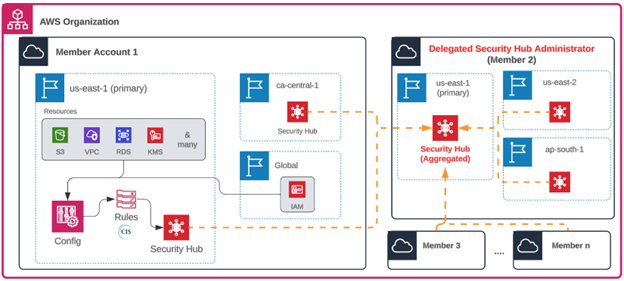
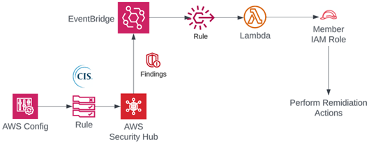
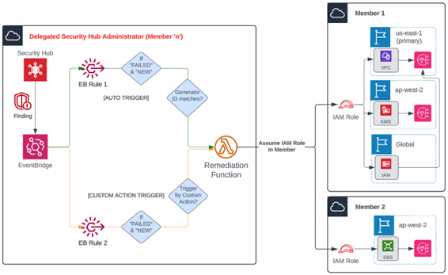

# Deploying CISv1.4.0 Security Benchmark recommended controls with Auto-remediation in an AWS Multi-account setup

This implementation uses AWS services like Security Hub, Lambda functions, and EventBridge rules, to perform near real-time "Automatic" remediation of NON-COMPLIANT resources in an AWS Organizations (multi-account) setup.

[Click here](#UPDATE THIS) to go to the Environment Setup
[Click here](#UPDATE THIS) to go to Remediation Action section

## 1. INTRODUCTION
### 1.1. Introduction
In the ever-evolving landscape of cloud computing, ensuring the security and compliance of cloud infrastructure has become paramount for organizations of all sizes. To address this critical need, the Center for Internet Security (CIS) has developed a set of comprehensive security benchmarks that provide organizations with a structured approach to securing their computer systems. 

By deploying the proposed automatic remediation solution for CIS security benchmarks in the AWS cloud, organizations can proactively fortify their infrastructure against potential threats and ensure adherence to industry-standard security configurations. This comprehensive approach will empower organizations to safeguard their sensitive data, maintain regulatory compliance, and foster a secure environment for their cloud operations.

### 1.2. What is CIS & CIS Benchmarks?

The Center for Internet Security (CIS) is a non-profit organization that develops and promotes best practices for securing IT systems and data, including cloud security. The CIS Benchmarks are a set of globally recognized and consensus-driven guidelines that help organizations protect against emerging cybersecurity risks. These benchmarks are developed with input from a global community of security experts and provide practical guidance for implementing and managing cybersecurity defenses.

### 1.3.	What are CIS AWS Foundations Benchmarks?

The CIS AWS Foundations Benchmark is a set of security best practices for Amazon Web Services (AWS) resources. It provides prescriptive instructions for configuring AWS services to ensure security and integrity. The most recent version is v1.4.0, released in 2021. Following this benchmark helps organizations reduce security risks and maintain compliance with industry regulations.

### 1.4.	Importance of CIS Benchmarks

The CIS Benchmarks are globally recognized and accepted best practice guides for securing IT infrastructure. The benchmarks are freely available for download and implementation, and provide up-to-date, step-by-step instructions for organizations to secure their infrastructure. 

The CIS Benchmarks align with major security and data privacy frameworks such as: 
* National Institute of Standards and Technology (**NIST**) Cybersecurity Framework
* Health Insurance Portability and Accountability Act (**HIPAA**)
* Payment Card Industry Data Security Standard (**PCI DSS**)

### 1.5.	CISv1.4.0 Recommended Controls

The CISv1.4.0 Control is composed of 4 sections with a total of 58 controls known as “recommendations.”
Below are the four sections:

- Identity and Access Management – 21 Controls
- Storage – 7 Controls
- Logging – 11 Controls
- Monitoring – 15 Controls
- Networking – 4 Controls

### 1.6.	Problem Statement

In an AWS Organization setup with hundreds of accounts, enforcing organization-level security regulations for each resource deployed in various regions is a tedious task. An organization's security team will need to put a lot of effort into taking necessary actions to increase the Compliancy score.

## 2. PROPOSED ARCHITECTURE

### 2.1. Security Hub setup in AWS Organizations

In an AWS Organizations setup, there will be a [Delegated Administrator Account](https://docs.aws.amazon.com/organizations/latest/userguide/orgs_delegate_policies.html) for Security Hub. This account will act as a Centralized Security Dashboard for the entire organization.

### 2.2. Remediation Action Flow based on a Security Hub Finding - Simplified

### 2.3. Remediation Action Flow based on a Security Hub Finding - Detailed

The above architecture will be explained in detail in the [Remediation Actions](#UPDATE THIS) section

## 3. REQUIRED AWS SERVICES & COMPONENTS

- [Config](https://docs.aws.amazon.com/config/latest/developerguide/WhatIsConfig.html) - the primary source that performs security configuration checks and sends them to AWS Security Hub.

- [Security Hub](https://docs.aws.amazon.com/securityhub/latest/userguide/what-is-securityhub.html) - provides a Centralized Security Dashboard that displays security finding status across all organization member accounts in a prioritized manner. Security Hub currently supports automated checks for standards like, 
    - AWS Foundational Security Best Practices (FSBP) v1.0.0
    - CIS Benchmarks v1.2.0
    - CIS Benchmarks v1.4.0
    - NIST 800-53 Revision 5
- [EventBridge](https://docs.aws.amazon.com/eventbridge/latest/userguide/eb-what-is.html) - helps in setting up rule-based triggers that will deliver events to selected targets.

- [Lambda](https://docs.aws.amazon.com/lambda/latest/dg/welcome.html) - event-driven serverless compute service that allows us to run our code in response to event triggers like EventBridge rules, without having to provision or manage servers.

- [IAM Roles](https://docs.aws.amazon.com/IAM/latest/UserGuide/id_roles.html) - it is an identity that has specific permissions. Unlike an IAM user, an IAM role does not have long-term credentials.  when you assume a role, it provides temporary security credentials for the role session. Some AWS Services will assume an IAM role to perform necessary actions.

- [Simple Notification Service](https://docs.aws.amazon.com/sns/latest/dg/welcome.html) - a fully managed distributed publish-subscribe system allowing mass delivery of emails, messages, and notifications.

- [CloudFormation StackSet](https://docs.aws.amazon.com/cloudformation/) - an Infrastructure-as-a-Code solution that helps in quick deployment of resources across multiple accounts and regions under a single operational management framework.
